 

  
  
  

## `01` About Me

<table>
<tr>
<td width="60%" valign="top">

I'm **19**, and I spend most of my time figuring out how the systems around us actually work — and how they break.

My interest sits right in the overlap between **software development**, **cybersecurity** and **AI**. I like the duality of the offensive/defensive mindset: understanding how something can be attacked is what makes you able to defend it properly.

Currently focused on:

- 🔐 Offensive & defensive security fundamentals
- 🐍 Backend development with Python, Java & SQL
- 🌐 Web development & CMS-based platforms
- 🤖 Exploring practical AI tooling and automation
- 📡 Sharing what I learn — cybersecurity tips, dev projects, and behind-the-scenes builds

</td>
<td width="40%" valign="top" align="center">

</td>
</tr>
</table>

## `02` Tech Stack

<table align="center">
<tr>
<td valign="top" width="33%">

**Languages**

</td>
<td valign="top" width="33%">

**Tools & Platforms**

</td>
<td valign="top" width="33%">

**Web & Systems**

</td>
</tr>
</table>

## `03` Development Philosophy

<table align="center">
<tr>
<td align="center" width="25%">

**🧩 Understand first**
 Study how a system works before touching it

</td>
<td align="center" width="25%">

**🛡️ Think both sides**
 Offense informs defense, and vice versa

</td>
<td align="center" width="25%">

**🧪 Build to learn**
 Every project is an experiment, not a finished product

</td>
<td align="center" width="25%">

**📖 Document everything**
 Clean code and clear notes outlive the moment

</td>
</tr>
</table>

## `04` Network Visualization

A simplified map of my current stack, routed through a central node
  

## `05` Cybersecurity & AI

Where offensive security thinking meets automated pattern recognition
  

<table align="center">
<tr>
<td width="50%" valign="top">

**Cybersecurity interests**
- Network fundamentals & lab simulation (Packet Tracer, VirtualBox)
- Offensive tooling on Kali Linux
- Reading about attack surfaces and mitigation strategies
- Practical, hands-on learning over theory alone

</td>
<td width="50%" valign="top">

**AI & Automation**
- Using AI tools to speed up research and prototyping
- Exploring where automation fits into a security workflow
- Curious about applying ML concepts to anomaly detection

</td>
</tr>
</table>

## `06` GitHub Analytics

## `07` Contribution Snake

Generated automatically — see <code>.github/workflows/snake.yml</code>

## `08` Trophies

## `09` Contact

